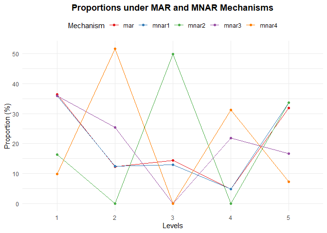

<!-- README.md is generated from README.Rmd. Please edit that file -->

# **ovsa**: ordinal variable sensitivity analysis

## Description

The goal of the `ovsa` package is to perform sensitivity analysis for
ordinal variables when specific categories of the ordinal variable are
prone to missingness (Missing Not At Random).

Our sensitivity analysis containes three step

1.  Performing MI under MAR

2.  Modifying the imputed data to reflect plausible scenarios under MNAR

3.  Analyzing the modified data and combining the results according to
    Rubin’s rule.

<!-- badges: start -->
<!-- badges: end -->

# Installation

You can install the development version of ovsa from
[GitHub](https://github.com/) with:

    # install.packages("pak")
    pak::pak("abdoulaye-dioni/ovsa")

    # install.packages("devtools")  # Uncomment if you don't have devtools installed
    devtools::install_github("abdoulaye-dioni/ovsa")

# Example

``` r
library(ovsa)
```

## Non hierarchical data from the `ovsa` package

``` r
data("simda") 
head(simda)
#>   id X2 X1 Y
#> 1  1  3  5 0
#> 2  2  1  4 0
#> 3  3  3  5 0
#> 4  4  1  1 0
#> 5  5  1  1 0
#> 6  6  2  1 0
```

## The `simmnar` function from the `ovsa` package

Use the `simmnar` function from the `ovsa` package to simulate a Missing
Not At Random (MNAR) mechanism in ordinal variables with specified
probabilities for missing values.

``` r
set.seed(321) # for reproducibility
simdaNA <- simmnar( data = simda, Y = "Y",  id = "id",
ord_var = "X1", A = 2,  probA = 0.5, B = 4,  probB = 0.8) # use simmnar
```

``` r
head(simdaNA)
#>   id X2 X1 Y X1.mis
#> 1  1  3  5 0      5
#> 2  2  1  4 0   <NA>
#> 3  3  3  5 0      5
#> 4  4  1  1 0      1
#> 5  5  1  1 0      1
#> 6  6  2  1 0      1
```

``` r
summary(simdaNA)
#>        id         X2      X1      Y        X1.mis   
#>  Min.   :   1.0   1:248   1:272   0:576   1   :272  
#>  1st Qu.: 250.8   2:247   2:118   1:424   2   : 89  
#>  Median : 500.5   3:260   3:131           3   :131  
#>  Mean   : 500.5   4:245   4:127           4   : 49  
#>  3rd Qu.: 750.2           5:352           5   :352  
#>  Max.   :1000.0                           NA's:107
```

``` r
str(simdaNA)
#> 'data.frame':    1000 obs. of  5 variables:
#>  $ id    : int  1 2 3 4 5 6 7 8 9 10 ...
#>  $ X2    : Factor w/ 4 levels "1","2","3","4": 3 1 3 1 1 2 4 1 4 3 ...
#>  $ X1    : Ord.factor w/ 5 levels "1"<"2"<"3"<"4"<..: 5 4 5 1 1 1 3 3 5 1 ...
#>  $ Y     : Factor w/ 2 levels "0","1": 1 1 1 1 1 1 2 2 2 1 ...
#>  $ X1.mis: Ord.factor w/ 5 levels "1"<"2"<"3"<"4"<..: 5 NA 5 1 1 1 3 3 5 1 ...
```

## The `firststep` function from the `ovsa` package

Use the `firststep` function from the `ovsa` package to impute missing
values in a non-hierarchical context. This function performs the first
step of our sensitivity analysis for ordinal variables under a Missing
Not At Random (MNAR) mechanism.

``` r
library(mice)
#> 
#> Attachement du package : 'mice'
#> L'objet suivant est masqué depuis 'package:stats':
#> 
#>     filter
#> Les objets suivants sont masqués depuis 'package:base':
#> 
#>     cbind, rbind
imputed_mice <- firststep(simdaNA[, c("Y","X1.mis","X2")], mi = "mice",
method = c("logreg", "polr", "polyreg"), m = 10,printFlag = FALSE)
```

``` r
summary(complete(imputed_mice,1))
#>  Y       X1.mis  X2     
#>  0:576   1:316   1:248  
#>  1:424   2:105   2:247  
#>          3:144   3:260  
#>          4: 55   4:245  
#>          5:380
```

## The `secondstep` function from the `ovsa` package

Use the `secondstep` function from the `ovsa` package to modifie imputed
values in a non-hierarchical context. This function performs the second
step of our sensitivity analysis for ordinal variables under a Missing
Not At Random (MNAR) mechanism.

``` r
formula <- "X1.mis.mar ~ Y + X2"
manydelta <- data.frame( delta1 = c(0,0,0,0), delta2 = c(0,-1,2,0),
delta3 = c(0,0.5,0,0.5), delta4 = c(-1,0.5,0,1))
level_ord_var = 5
seed = 123
```

``` r
# Execution of the complete function
out <- secondstep(data = simdaNA, mardata = imputed_mice,
level_ord_var = level_ord_var, formula = formula, manydelta = manydelta,
seed = seed)
```

``` r
summary(out$mnardata[[2]])
#>  Y       X1.mis.mar X2       X1.mis         eta               etanew       
#>  0:576   1:314      1:248   1   :272   Min.   :-0.01683   Min.   :-3.0647  
#>  1:424   2:100      2:247   2   : 89   1st Qu.: 0.00000   1st Qu.:-0.2196  
#>          3:145      3:260   3   :131   Median : 0.27528   Median : 0.5475  
#>          4: 53      4:245   4   : 49   Mean   : 0.49501   Mean   : 0.5375  
#>          5:388              5   :352   3rd Qu.: 0.90447   3rd Qu.: 1.3276  
#>                             NA's:107   Max.   : 1.17975   Max.   : 3.6617  
#>  mnar1   mnar2   mnar3   mnar4  
#>  1:309   1:288   1:309   1:280  
#>  2: 97   2: 89   2:111   2:140  
#>  3:145   3:179   3:131   3:131  
#>  4: 54   4: 49   4: 77   4: 87  
#>  5:395   5:395   5:372   5:362  
#> 
```

## The `checkprop` function from the `ovsa` package

Use the `checkprop` function from the `ovsa` package to assess the
plausibility of imputed data under the MAR mechanism and the
modifications made under MNAR mechanisms.

``` r
checkprop(data = out$mnardata, ord_mar = "X1.mis.mar",
ord_mis = "X1.mis", manydelta = manydelta)
#> $table
#>         mar     mnar1    mnar2    mnar3     mnar4
#> 1 36.448598 35.981308 16.35514 35.98131  9.813084
#> 2 12.242991 12.523364  0.00000 25.42056 51.588785
#> 3 14.485981 12.897196 49.90654  0.00000  0.000000
#> 4  4.859813  4.859813  0.00000 21.86916 31.308411
#> 5 31.962617 33.738318 33.73832 16.72897  7.289720
#> 
#> $plot
```



## The `thirdstep` function from the `ovsa package`

For MAR result

``` r
formula = "Y ~X1.mis.mar + X2"
thirdstep(data = out$mnardata, formula = formula)
#>           term   estimate std.error statistic       df      p.value      2.5 %
#> 1  (Intercept) -1.4884197 0.1852394 -8.035116 881.9827 2.988086e-15 -1.8519811
#> 2 X1.mis.mar.L  1.8485513 0.2083031  8.874334 188.0188 5.496901e-16  1.4376398
#> 3 X1.mis.mar.Q -2.2080150 0.2276447 -9.699392 505.9427 1.626287e-20 -2.6552602
#> 4 X1.mis.mar.C  0.3960548 0.2776616  1.426394 252.7139 1.549888e-01 -0.1507706
#> 5 X1.mis.mar^4  0.8428731 0.2553765  3.300512 359.3026 1.061772e-03  0.3406527
#> 6          X22  2.2998866 0.2675014  8.597660 729.1861 4.939782e-17  1.7747217
#> 7          X23  1.1458318 0.2513398  4.558895 607.5630 6.220316e-06  0.6522315
#> 8          X24  1.9200780 0.2620588  7.326899 789.0513 5.830050e-13  1.4056632
#>       97.5 %   conf.low  conf.high
#> 1 -1.1248583 -1.8519811 -1.1248583
#> 2  2.2594628  1.4376398  2.2594628
#> 3 -1.7607697 -2.6552602 -1.7607697
#> 4  0.9428803 -0.1507706  0.9428803
#> 5  1.3450935  0.3406527  1.3450935
#> 6  2.8250514  1.7747217  2.8250514
#> 7  1.6394321  0.6522315  1.6394321
#> 8  2.4344928  1.4056632  2.4344928
```

For MNAR result

``` r
thirdstep(data = out$mnardata, manydelta = manydelta)
#> $mnar1
#>          term   estimate std.error statistic       df      p.value      2.5 %
#> 1 (Intercept) -1.5101618 0.1886043 -8.007037 727.4657 4.655067e-15 -1.8804355
#> 2     mnar1.L  1.8938796 0.2040124  9.283160 268.2313 5.783816e-18  1.4922103
#> 3     mnar1.Q -2.2354285 0.2456111 -9.101495 171.2216 2.245079e-16 -2.7202442
#> 4     mnar1.C  0.3210729 0.2676885  1.199428 507.9486 2.309209e-01 -0.2048399
#> 5     mnar1^4  0.8823798 0.2671065  3.303475 203.9752 1.127752e-03  0.3557358
#> 6         X22  2.3570505 0.2730596  8.632000 567.2126 6.092931e-17  1.8207191
#> 7         X23  1.1708016 0.2528641  4.630162 603.9017 4.476256e-06  0.6742019
#> 8         X24  1.9544865 0.2667947  7.325808 623.8824 7.372114e-13  1.4305622
#>       97.5 %   conf.low  conf.high
#> 1 -1.1398880 -1.8804355 -1.1398880
#> 2  2.2955488  1.4922103  2.2955488
#> 3 -1.7506129 -2.7202442 -1.7506129
#> 4  0.8469858 -0.2048399  0.8469858
#> 5  1.4090237  0.3557358  1.4090237
#> 6  2.8933819  1.8207191  2.8933819
#> 7  1.6674014  0.6742019  1.6674014
#> 8  2.4784108  1.4305622  2.4784108
#> 
#> $mnar2
#>          term   estimate std.error  statistic       df      p.value      2.5 %
#> 1 (Intercept) -1.5003564 0.1767162 -8.4902035 883.8136 8.648985e-17 -1.8471888
#> 2     mnar2.L  1.8943330 0.1974335  9.5947922 882.9608 8.338327e-21  1.5068393
#> 3     mnar2.Q -1.8946152 0.2222258 -8.5256321 273.8960 1.040514e-15 -2.3321028
#> 4     mnar2.C  0.3890474 0.2674634  1.4545815 982.4505 1.461045e-01 -0.1358179
#> 5     mnar2^4  0.2171190 0.2356896  0.9212071 677.0857 3.572704e-01 -0.2456515
#> 6         X22  2.1817683 0.2569922  8.4896300 544.8110 1.974727e-16  1.6769515
#> 7         X23  1.0313774 0.2305003  4.4745167 845.2551 8.706092e-06  0.5789573
#> 8         X24  1.8135124 0.2469484  7.3436884 792.7315 5.163442e-13  1.3287623
#>       97.5 %   conf.low  conf.high
#> 1 -1.1535241 -1.8471888 -1.1535241
#> 2  2.2818266  1.5068393  2.2818266
#> 3 -1.4571275 -2.3321028 -1.4571275
#> 4  0.9139127 -0.1358179  0.9139127
#> 5  0.6798894 -0.2456515  0.6798894
#> 6  2.6865851  1.6769515  2.6865851
#> 7  1.4837975  0.5789573  1.4837975
#> 8  2.2982626  1.3287623  2.2982626
#> 
#> $mnar3
#>          term   estimate std.error statistic        df      p.value      2.5 %
#> 1 (Intercept) -1.5195589 0.1905306 -7.975407 927.60442 4.454125e-15 -1.8934799
#> 2     mnar3.L  1.8703640 0.2067992  9.044347 133.21361 1.566330e-15  1.4613291
#> 3     mnar3.Q -2.3760416 0.2425296 -9.796913 345.00407 3.724275e-20 -2.8530643
#> 4     mnar3.C  0.4024658 0.2752099  1.462396  91.80963 1.470476e-01 -0.1441400
#> 5     mnar3^4  1.3030697 0.2521711  5.167404 709.30142 3.088910e-07  0.8079787
#> 6         X22  2.4082343 0.2762202  8.718531 737.57850 1.851093e-17  1.8659628
#> 7         X23  1.2199235 0.2555751  4.773248 899.42771 2.115016e-06  0.7183305
#> 8         X24  1.9962675 0.2710459  7.365054 788.24644 4.467823e-13  1.4642103
#>       97.5 %   conf.low  conf.high
#> 1 -1.1456379 -1.8934799 -1.1456379
#> 2  2.2793988  1.4613291  2.2793988
#> 3 -1.8990188 -2.8530643 -1.8990188
#> 4  0.9490715 -0.1441400  0.9490715
#> 5  1.7981607  0.8079787  1.7981607
#> 6  2.9505057  1.8659628  2.9505057
#> 7  1.7215166  0.7183305  1.7215166
#> 8  2.5283246  1.4642103  2.5283246
#> 
#> $mnar4
#>          term   estimate std.error  statistic        df      p.value      2.5 %
#> 1 (Intercept) -1.5686285 0.1897447  -8.267050 973.43100 4.468514e-16 -1.9409841
#> 2     mnar4.L  1.9871903 0.1962022  10.128276 320.39312 4.241320e-21  1.6011828
#> 3     mnar4.Q -2.3506969 0.2305305 -10.196901 846.47858 4.157420e-23 -2.8031754
#> 4     mnar4.C  0.2879418 0.2599561   1.107656  87.68908 2.710397e-01 -0.2286918
#> 5     mnar4^4  1.3985874 0.2410387   5.802335 900.97791 9.051327e-09  0.9255247
#> 6         X22  2.3750949 0.2684154   8.848580 955.84902 4.218333e-18  1.8483435
#> 7         X23  1.2073468 0.2527399   4.777033 974.54225 2.052340e-06  0.7113697
#> 8         X24  1.9820478 0.2650868   7.476976 980.11995 1.685203e-13  1.4618448
#>       97.5 %   conf.low  conf.high
#> 1 -1.1962728 -1.9409841 -1.1962728
#> 2  2.3731977  1.6011828  2.3731977
#> 3 -1.8982184 -2.8031754 -1.8982184
#> 4  0.8045754 -0.2286918  0.8045754
#> 5  1.8716501  0.9255247  1.8716501
#> 6  2.9018464  1.8483435  2.9018464
#> 7  1.7033240  0.7113697  1.7033240
#> 8  2.5022508  1.4618448  2.5022508
```
