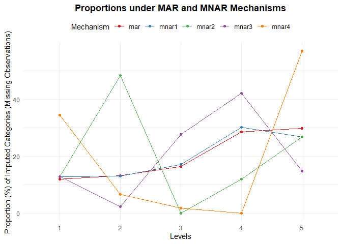

<!-- README.md is generated from README.Rmd. Please edit that file -->

# **ovsa**: ordinal variable sensitivity analysis

## Description

The goal of the ovsa package is to perform sensitivity analysis for
ordinal variables when specific categories are prone to missingness
under a Missing Not At Random (MNAR) mechanism.

1.  Our sensitivity analysis procedure involves three main steps:

2.  Performing multiple imputation (MI) under the MAR assumption and

Modifying the imputed values to reflect plausible MNAR scenarios

3.  Analyzing the modified datasets and combining the results using
    Rubin’s rules

# Installation

You can install the development version of ovsa from GitHub using either
\*\**pak*

or **devtools**

``` r
# install.packages("pak")
pak::pak("abdoulaye-dioni/ovsa")
```

``` r
# install.packages("devtools")
devtools::install_github("abdoulaye-dioni/ovsa")
```

# Example

Below is a simple workflow illustrating the main steps of the ovsa
package for

non hierarchical data.

``` r
library(ovsa)
```

## Non hierarchical data from the `ovsa` package

``` r
data("simda") 
head(simda)
#>   id X2 X1 Y
#> 1  1  c  5 1
#> 2  2  c  3 0
#> 3  3  c  5 1
#> 4  4  b  2 0
#> 5  5  c  2 0
#> 6  6  b  4 0
```

## Simulating MNAR with **simmnar()**

Use the simmnar() function to simulate a Missing Not At Random (MNAR)
mechanism for ordinal variables:

``` r
set.seed(321)
simdaNA <- simmnar(data = simda, Y = "Y",
                   ord_var = "X1", A = 2, probA = 0.5,
                   B = 4, probB = 0.8, verbose = TRUE)
#> 192 missing values introduced into X1.mis.
head(simdaNA)
#>   id X2 X1 Y X1.mis
#> 1  1  c  5 1      5
#> 2  2  c  3 0      3
#> 3  3  c  5 1      5
#> 4  4  b  2 0      2
#> 5  5  c  2 0      2
#> 6  6  b  4 0   <NA>
summary(simdaNA)
#>        id         X2      X1      Y        X1.mis   
#>  Min.   :   1.0   a:249   1:126   0:607   1   :126  
#>  1st Qu.: 250.8   b:248   2:162   1:393   2   :144  
#>  Median : 500.5   c:257   3:178           3   :178  
#>  Mean   : 500.5   d:246   4:254           4   : 80  
#>  3rd Qu.: 750.2           5:280           5   :280  
#>  Max.   :1000.0                           NA's:192
str(simdaNA)
#> 'data.frame':    1000 obs. of  5 variables:
#>  $ id    : int  1 2 3 4 5 6 7 8 9 10 ...
#>  $ X2    : Factor w/ 4 levels "a","b","c","d": 3 3 3 2 3 2 2 2 3 1 ...
#>  $ X1    : Ord.factor w/ 5 levels "1"<"2"<"3"<"4"<..: 5 3 5 2 2 4 2 5 5 4 ...
#>  $ Y     : Factor w/ 2 levels "0","1": 2 1 2 1 1 1 1 2 2 1 ...
#>  $ X1.mis: Ord.factor w/ 5 levels "1"<"2"<"3"<"4"<..: 5 3 5 2 2 NA 2 5 5 4 ...
```

## Step 1: Imputation under MAR with `firststep()`

Use the `firststep` function from the `ovsa` package to impute missing
values in a non-hierarchical context. This function performs the first
step of our sensitivity analysis for ordinal variables under a Missing
Not At Random (MNAR) mechanism.

``` r
library(mice)
#> 
#> Attachement du package : 'mice'
#> L'objet suivant est masqué depuis 'package:stats':
#> 
#>     filter
#> Les objets suivants sont masqués depuis 'package:base':
#> 
#>     cbind, rbind
imputed_mice <- firststep(simdaNA[, c("Y", "X1.mis", "X2")],
                          mi = "mice",
                          method = c("logreg", "polr", "polyreg"),
                          m = 10,
                          printFlag = FALSE,verbose = FALSE)

summary(complete(imputed_mice, 1))
#>  Y       X1.mis  X2     
#>  0:607   1:169   a:249  
#>  1:393   2:192   b:248  
#>          3:225   c:257  
#>          4:100   d:246  
#>          5:314
```

``` r
summary(complete(imputed_mice,1))
#>  Y       X1.mis  X2     
#>  0:607   1:169   a:249  
#>  1:393   2:192   b:248  
#>          3:225   c:257  
#>          4:100   d:246  
#>          5:314
```

## Step 2: Modify imputed values with `secondstep()`

``` r
formula <- "X1.mis.mar ~ Y + X2"
manydelta <- data.frame(
  delta1 = c(0, 0, 0, 0),
  delta2 = c(0, -1, 2, 0),
  delta3 = c(0, 0.5, 0, 0.5),
  delta4 = c(-1, 0.5, 0, 1)
)

level_ord_var <- 5
seed <- 123
```

``` r
out <- secondstep_mice(data = simdaNA, mardata = imputed_mice,
                  level_ord_var = level_ord_var,
                  formula = formula,
                  manydelta = manydelta,
                  seed = seed)
#> Preparing imputed datasets...
#> Fitting ordinal regression models...
#> Extracting and adjusting thresholds...
#> Constructing latent variables and MNAR columns...
#> Done. Returning modified datasets.

summary(out$mnardata[[2]])
#>  Y       X1.mis.mar X2       X1.mis         eta             etanew       
#>  0:607   1:165      a:249   1   :126   Min.   :0.0000   Min.   :-3.0479  
#>  1:393   2:191      b:248   2   :144   1st Qu.:0.2036   1st Qu.:-0.1249  
#>          3:235      c:257   3   :178   Median :0.4624   Median : 0.6761  
#>          4: 91      d:246   4   : 80   Mean   :0.6320   Mean   : 0.6745  
#>          5:318              5   :280   3rd Qu.:1.1745   3rd Qu.: 1.4863  
#>                             NA's:192   Max.   :1.4332   Max.   : 4.7238  
#>  mnar1   mnar2   mnar3   mnar4  
#>  1:167   1:167   1:167   1:134  
#>  2:175   2:144   2:212   2:245  
#>  3:228   3:328   3:191   3:191  
#>  4: 99   4: 80   4:126   4:141  
#>  5:331   5:281   5:304   5:289  
#> 
```

``` r
summary(out$mnardata[[2]])
#>  Y       X1.mis.mar X2       X1.mis         eta             etanew       
#>  0:607   1:165      a:249   1   :126   Min.   :0.0000   Min.   :-3.0479  
#>  1:393   2:191      b:248   2   :144   1st Qu.:0.2036   1st Qu.:-0.1249  
#>          3:235      c:257   3   :178   Median :0.4624   Median : 0.6761  
#>          4: 91      d:246   4   : 80   Mean   :0.6320   Mean   : 0.6745  
#>          5:318              5   :280   3rd Qu.:1.1745   3rd Qu.: 1.4863  
#>                             NA's:192   Max.   :1.4332   Max.   : 4.7238  
#>  mnar1   mnar2   mnar3   mnar4  
#>  1:167   1:167   1:167   1:134  
#>  2:175   2:144   2:212   2:245  
#>  3:228   3:328   3:191   3:191  
#>  4: 99   4: 80   4:126   4:141  
#>  5:331   5:281   5:304   5:289  
#> 
```

## Check plausibility with `checkprop()`

``` r
checkprop(data = out$mnardata,
          ord_mar = "X1.mis.mar",
          ord_mis = "X1.mis",
          manydelta = manydelta)
#> $table
#>        mar     mnar1     mnar2     mnar3     mnar4
#> 1 23.22917 22.083333 22.083333 22.083333  4.322917
#> 2 24.16667 22.604167  0.000000 40.677083 58.437500
#> 3 24.63542 23.333333 76.875000  5.260417  5.260417
#> 4  7.34375  9.427083  0.000000 21.250000 27.708333
#> 5 20.62500 22.552083  1.041667 10.729167  4.270833
#> 
#> $plot
```



## Step 4: Final analysis with `thirdstep()`

``` r
formula <- "Y ~ X1.mis.mar + X2"

# Analysis for MAR
thirdstep_mice(data = out$mnardata, formula = formula)
#>           term   estimate std.error statistic       df      p.value      2.5 %
#> 1  (Intercept) -1.3080085 0.1710881 -7.645232 831.4313 5.756427e-14 -1.6438240
#> 2 X1.mis.mar.L  1.7617941 0.1921677  9.168003 190.2952 7.891561e-17  1.3827416
#> 3 X1.mis.mar.Q  0.8804233 0.1730646  5.087251 521.6876 5.076434e-07  0.5404341
#> 4 X1.mis.mar.C -0.4961025 0.2434016 -2.038206 124.3862 4.364951e-02 -0.9778477
#> 5 X1.mis.mar^4  0.5495191 0.1991266  2.759647 300.6493 6.141448e-03  0.1576607
#> 6          X2b  0.8299114 0.2253041  3.683516 733.7659 2.469434e-04  0.3875938
#> 7          X2c  0.8180834 0.2221247  3.682991 773.1735 2.465609e-04  0.3820444
#> 8          X2d  0.6811551 0.2299625  2.962027 488.7064 3.205055e-03  0.2293179
#>        97.5 %   conf.low   conf.high
#> 1 -0.97219305 -1.6438240 -0.97219305
#> 2  2.14084651  1.3827416  2.14084651
#> 3  1.22041250  0.5404341  1.22041250
#> 4 -0.01435733 -0.9778477 -0.01435733
#> 5  0.94137755  0.1576607  0.94137755
#> 6  1.27222891  0.3875938  1.27222891
#> 7  1.25412237  0.3820444  1.25412237
#> 8  1.13299231  0.2293179  1.13299231

# Analysis for MNAR
thirdstep_mice(data = out$mnardata, manydelta = manydelta)
#> $mnar1
#>          term   estimate std.error statistic       df      p.value      2.5 %
#> 1 (Intercept) -1.3246051 0.1731645 -7.649404 628.9897 7.604332e-14 -1.6646556
#> 2     mnar1.L  1.7000440 0.1861616  9.132087 292.6458 1.140050e-17  1.3336587
#> 3     mnar1.Q  0.8856254 0.1791687  4.942970 269.4031 1.354169e-06  0.5328766
#> 4     mnar1.C -0.4594599 0.2404779 -1.910612 137.9896 5.812875e-02 -0.9349580
#> 5     mnar1^4  0.5965721 0.1955006  3.051510 409.2310 2.425271e-03  0.2122613
#> 6         X2b  0.8200315 0.2253022  3.639696 674.5516 2.938367e-04  0.3776536
#> 7         X2c  0.8266093 0.2201793  3.754255 830.5055 1.859712e-04  0.3944360
#> 8         X2d  0.6909419 0.2237458  3.088067 746.2778 2.089271e-03  0.2516959
#>        97.5 %   conf.low   conf.high
#> 1 -0.98455461 -1.6646556 -0.98455461
#> 2  2.06642929  1.3336587  2.06642929
#> 3  1.23837433  0.5328766  1.23837433
#> 4  0.01603811 -0.9349580  0.01603811
#> 5  0.98088294  0.2122613  0.98088294
#> 6  1.26240940  0.3776536  1.26240940
#> 7  1.25878255  0.3944360  1.25878255
#> 8  1.13018793  0.2516959  1.13018793
#> 
#> $mnar2
#>          term   estimate std.error statistic       df      p.value      2.5 %
#> 1 (Intercept) -1.2605386 0.1718069 -7.336948 988.9681 4.549263e-13 -1.5976866
#> 2     mnar2.L  1.9345104 0.1852539 10.442480 844.9872 4.310624e-24  1.5708986
#> 3     mnar2.Q  1.1115707 0.1726029  6.440048 789.0737 2.074171e-10  0.7727556
#> 4     mnar2.C -0.3948537 0.2264007 -1.744048 979.8770 8.146431e-02 -0.8391397
#> 5     mnar2^4  0.1973011 0.1874286  1.052673 986.3282 2.927486e-01 -0.1705036
#> 6         X2b  0.8915681 0.2241798  3.977022 985.9341 7.488508e-05  0.4516437
#> 7         X2c  0.8714537 0.2217619  3.929681 988.5640 9.097735e-05  0.4362755
#> 8         X2d  0.7210555 0.2233824  3.227897 989.0082 1.288042e-03  0.2826975
#>        97.5 %   conf.low   conf.high
#> 1 -0.92339053 -1.5976866 -0.92339053
#> 2  2.29812226  1.5708986  2.29812226
#> 3  1.45038581  0.7727556  1.45038581
#> 4  0.04943233 -0.8391397  0.04943233
#> 5  0.56510579 -0.1705036  0.56510579
#> 6  1.33149252  0.4516437  1.33149252
#> 7  1.30663191  0.4362755  1.30663191
#> 8  1.15941346  0.2826975  1.15941346
#> 
#> $mnar3
#>          term   estimate std.error statistic       df      p.value      2.5 %
#> 1 (Intercept) -1.3151007 0.1714331 -7.671220 902.6829 4.408252e-14 -1.6515545
#> 2     mnar3.L  1.7923448 0.1793299  9.994679 539.0830 1.082898e-21  1.4400737
#> 3     mnar3.Q  0.9473136 0.1742162  5.437574 535.7849 8.220201e-08  0.6050830
#> 4     mnar3.C -0.3493832 0.2301950 -1.517770 125.6469 1.315844e-01 -0.8049447
#> 5     mnar3^4  0.9276269 0.1860019  4.987190 711.8114 7.704828e-07  0.5624489
#> 6         X2b  0.8464080 0.2267190  3.733290 862.7456 2.013894e-04  0.4014225
#> 7         X2c  0.8243601 0.2223093  3.708167 936.8592 2.210288e-04  0.3880782
#> 8         X2d  0.7203452 0.2283390  3.154718 749.5597 1.670696e-03  0.2720851
#>       97.5 %   conf.low  conf.high
#> 1 -0.9786470 -1.6515545 -0.9786470
#> 2  2.1446158  1.4400737  2.1446158
#> 3  1.2895442  0.6050830  1.2895442
#> 4  0.1061784 -0.8049447  0.1061784
#> 5  1.2928048  0.5624489  1.2928048
#> 6  1.2913934  0.4014225  1.2913934
#> 7  1.2606419  0.3880782  1.2606419
#> 8  1.1686052  0.2720851  1.1686052
#> 
#> $mnar4
#>          term   estimate std.error statistic       df      p.value      2.5 %
#> 1 (Intercept) -1.2924246 0.1718743 -7.519591 932.0179 1.290283e-13 -1.6297300
#> 2     mnar4.L  1.6910924 0.1830848  9.236660 613.3348 4.108912e-19  1.3315432
#> 3     mnar4.Q  1.2148767 0.1746557  6.955838 782.0813 7.408808e-12  0.8720272
#> 4     mnar4.C -0.4424532 0.2132233 -2.075070 262.4164 3.895449e-02 -0.8622995
#> 5     mnar4^4  1.0607755 0.1837247  5.773723 658.9475 1.194693e-08  0.7000191
#> 6         X2b  0.8950674 0.2293793  3.902127 904.3498 1.024235e-04  0.4448897
#> 7         X2c  0.8334793 0.2249550  3.705093 936.3176 2.236950e-04  0.3920049
#> 8         X2d  0.7541997 0.2273538  3.317296 951.4716 9.433614e-04  0.3080269
#>        97.5 %   conf.low   conf.high
#> 1 -0.95511907 -1.6297300 -0.95511907
#> 2  2.05064160  1.3315432  2.05064160
#> 3  1.55772611  0.8720272  1.55772611
#> 4 -0.02260695 -0.8622995 -0.02260695
#> 5  1.42153192  0.7000191  1.42153192
#> 6  1.34524515  0.4448897  1.34524515
#> 7  1.27495374  0.3920049  1.27495374
#> 8  1.20037246  0.3080269  1.20037246
```
